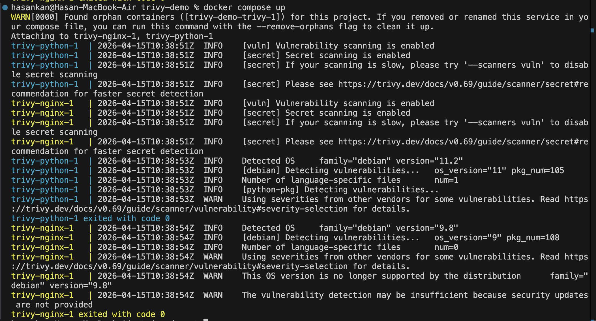

# Trivy — Container Vulnerability Scanner

**YZV 322E Applied Data Engineering | Spring 2026**

---

## 1. What is this tool?

Trivy is an open-source vulnerability scanner developed by Aqua Security (released 2019, Apache 2.0 license). It scans container images, filesystems, and dependencies for known CVEs (Common Vulnerabilities and Exposures) and misconfigurations. Unlike alternatives such as Docker Scout or Snyk, Trivy requires zero configuration and works entirely offline after its database is cached.

---

## 2. Prerequisites

| Requirement | Version |
|-------------|---------|
| OS | macOS, Linux, or Windows (WSL2) |
| Docker | 20.10+ |
| Docker Compose | v2.0+ |
| Disk space | ~200 MB (Trivy vulnerability DB) |

No additional software or paid licence required.

---

## 3. Installation

Clone the repository and pull the Trivy image:

```bash
git clone https://github.com/<your-username>/trivy-demo.git
cd trivy-demo
docker pull ghcr.io/aquasecurity/trivy:latest
```

Verify the installation:

```bash
docker run --rm ghcr.io/aquasecurity/trivy:latest --version
```

---

## 4. Running the Example

### Quick scan — single image

```bash
docker run --rm ghcr.io/aquasecurity/trivy:latest image python:3.6-slim
```

### Full demo — scan multiple images and save JSON reports

```bash
bash scan.sh
```

Reports are saved to the `reports/` directory as JSON files.

### Using Docker Compose (mounts local Docker socket)

```bash
docker compose up
```

This scans `nginx:1.14` and `python:3.6-slim` and writes results to `reports/`.

---

## 5. Expected Output



Trivy detects the OS, scans for vulnerabilities and secrets in both images. Full JSON reports are written to `reports/nginx-1.14.json` and `reports/python-3.6-slim.json`.

---

## 6. AI Usage Disclosure

See [ai_usage_disclosure.md](ai_usage_disclosure.md).
